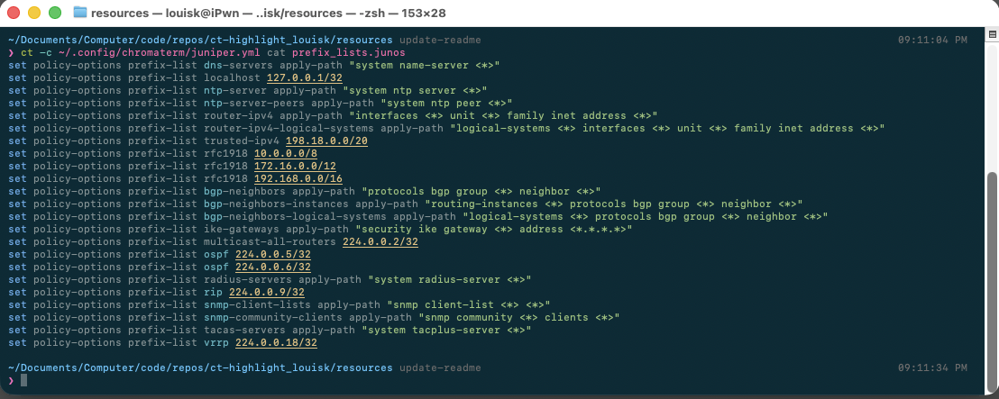

# **ct-highlighting**

**TLDR:** This repo will install a collection of chromaterm config files (\*.yml) that
can be used for real-time syntax highlighting of remote devices including UNIX/Linux,
Juniper and others.

## **TOC**

- [Summary](#summary)
- [Benefits](#benefits)
- [Pre-requisites](#pre-requisites)
- [Usage](#usage)
- [Limitations](#limitations)
- [ThankYou](#thankyou)

## **Summary**

Reading through network device output can be challenging. There is a lot of
text, which can make it difficult to scan through and quickly find what you're
looking for.


**It can be a lot easier when relevant parts are highlighted, allowing you to search
faster**


This repo is the syntax highlighting I use on a frequent, if not daily basis
when I have to work over an SSH session to network or UNIX/Linux devices.

**Note:** Everything has been designed to work on a dark (black/gray) terminal
background, or blueish(solarized dark), as you can see in the images above.

## **Examples**

- **Reading Junos Security Policy Rules (Junos)**
  
  

- **Reading show bgp summary (Junos)**
  

- **Reading show interfaces (Junos)**
  

- **Reading Prefix lists (Junos)**
  

## **Benefits**

- Quicker troubleshooting allows you to more easily identify mis-configurations
  or issues like interfaces in up/down.
- Color codes can be customized to your liking. [HTML color codes][html_color_codes]
- You can define your own regexes to work with what ever platform you want.

## **Pre-requisites**

- Python 3.7+ Recommended (currently using what ever is the default for homebrew)
- [Chromaterm][chromaterm]
- On a Mac with [homebrew][homebrew] install [uv][uv]
  with `brew install uv`
- Install chromaterm with `uv tool install chromaterm`
  - By default, uv will install things in `${XDG_BIN_HOME}/bin/`
    (probably `${HOME}/.config/bin/`)
  - Add it to your path if its not already there
    - For bash: `echo 'PATH=$PATH:${HOME}/.config/bin/' >> ${HOME}/.bash_profile`
    - For zsh: `echo 'path=(path ${HOME}/.config/bin/)' >> ${HOME}/.zshrc`
  - You can also install with `pip install chromaterm`

## **Usage**

- Clone this repo: `git clone git@github.com:louisk/ct-highlight.git`
- Run `make install`. This will create files in `${XDG_CONFIG_HOME}/chromaterm/`
- Last, connect to a `Juniper` via ssh and issue a `show interfaces`
  - `ct -c ${XDG_CONFIG_HOME/chromaterm/juniper.yml ssh user@device`

## **Customizing**

Couple options for customizing.

1. You can create your own profile(s) from scratch. If you prefix the profile name
   with `chromaterm-`, it will automagically get picked up by the Makefile when you
   run `make install`.Its a lot of regex and testing. A lot of the testing is going back
   and forth because the expressions weren't quite correct, or
   they were ordered wrong, or they did/didn't use exclusive.
2. Modify the existing profiles. Changing colors is pretty straight forward. Adding
   expressions or modifying expressions is more like the previous option, with lots
   of testing and adjusting.

- If you have any running chromaterm processes, you can run `make restart` (or
  append it to the above for `make build install restart` or `make all` for
  short)

If you don't want to prepend your command with `ct` every time, I wrote a zsh
(zgenom) module you can install by adding this to your .zshrc.d/plugins.zsh:

```bash
zgenom load lkowolowski/zsh-ssh-ct
```

## **Testing**

- I've included a `resources` dir with relevant snippets of config. You can run
  `ct -c ${XDG_CONFIG_HOME}/chromaterm/profile.yml cat resources/file` to see what it
  would look like.

## **Limitations**

- There are lots of (versions of) network operating systems. It's likely that
  not all of them will work with the current set of config files, but you can
  easily modify it by adding or changing the regular expressions to make the content
  you want colored the way you want.
- [This config file](chromaterm-juniper.yml) has been tested with SRX, EX, QFX,
  and MX platforms.
- [This config file](chromaterm-unix.yml) has been tested with MacOS, FreeBSD
  and Linux platforms.
- For more information on the `chromaterm` config file options check out
  [ChromaTerm Highlight Rules][chromaterm_highlight_rules]
- For help with regex, I used [regex101][regex101]

## **ThankYou**

Thanks to [hSaria][hsaria] for creating [Chromaterm][chromaterm]

[html_color_codes]: https://htmlcolorcodes.com/
[homebrew]: https://brew.sh
[uv]: https://docs.astral.sh/uv/
[chromaterm_highlight_rules]: https://github.com/hSaria/ChromaTerm#highlight-rules
[regex101]: https://regex101.com
[hsaria]: https://github.com/hSaria
[chromaterm]: https://github.com/hSaria/ChromaTerm
