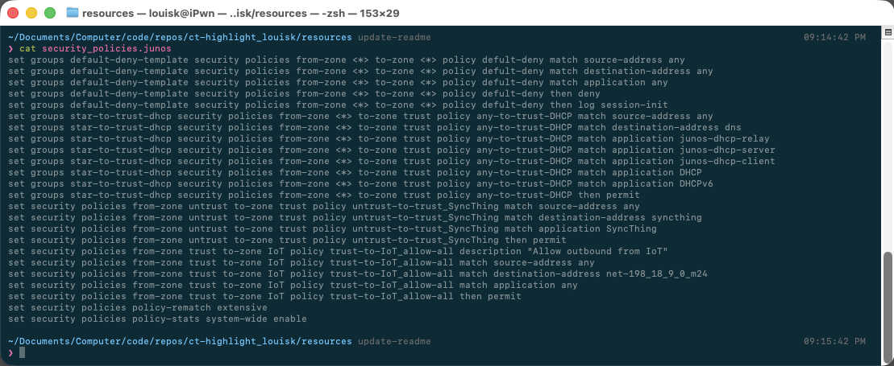
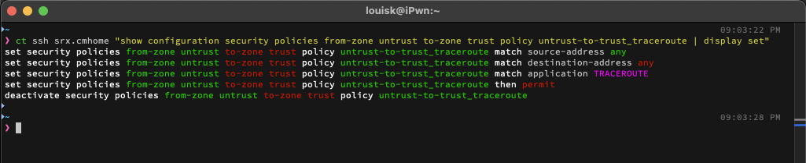
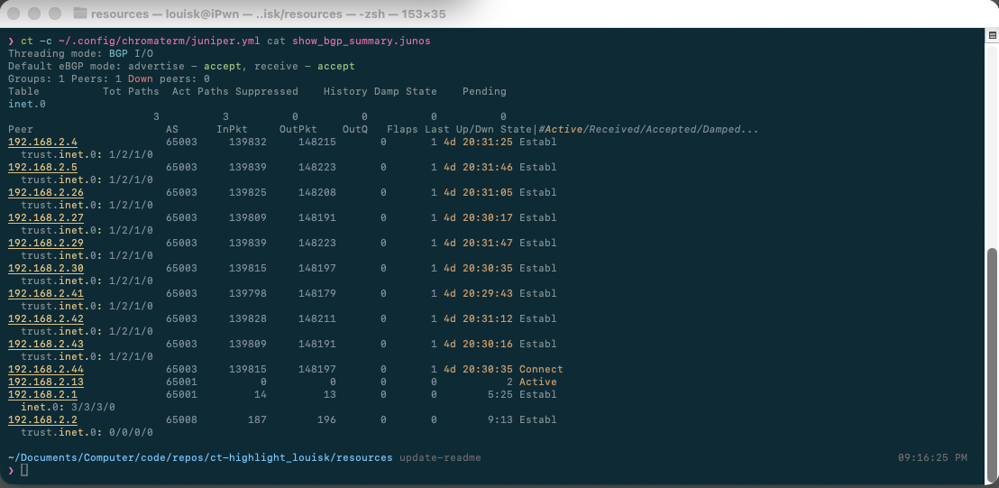
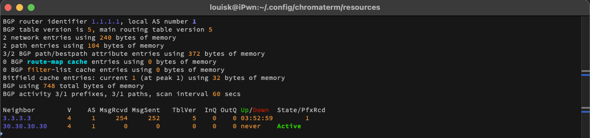
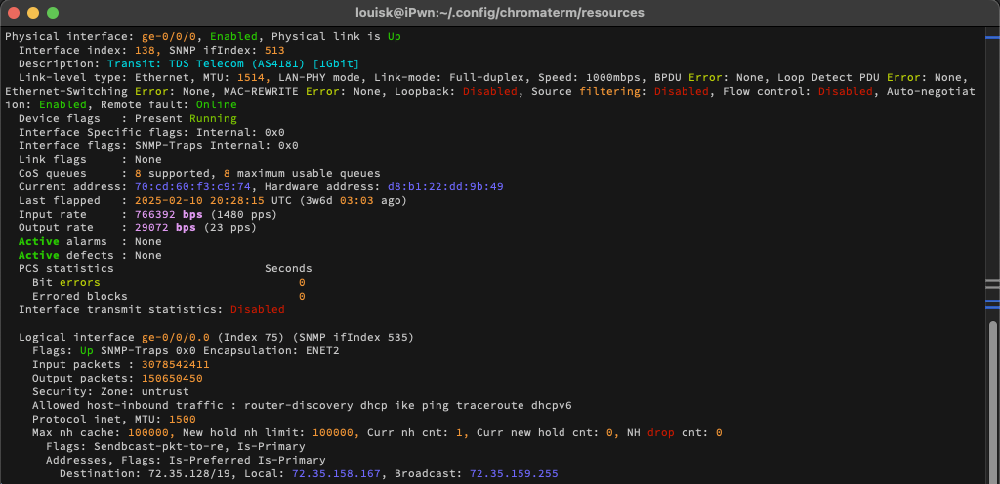
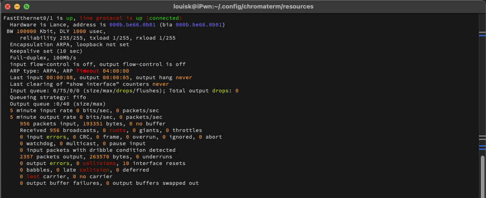
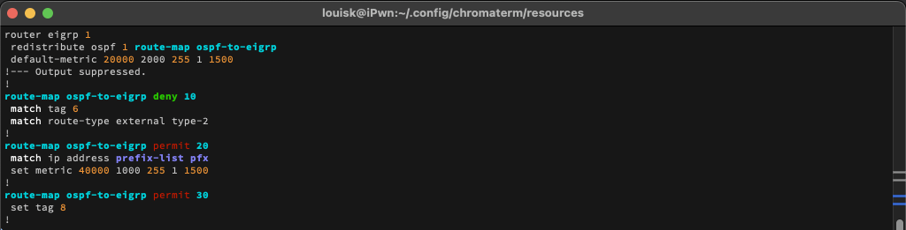
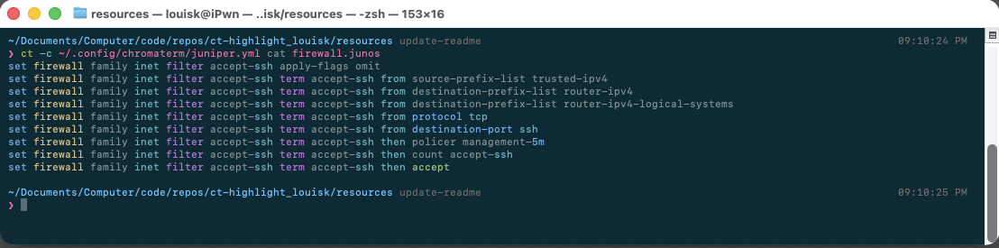
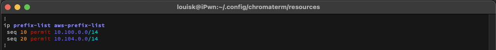

# ct-highlighting

**TLDR:** This repo will generate a chromaterm config (chromaterm.yml) that can be used for real-time syntax highlighting of network device config including Juniper, Cisco, Force10, and others.

## TOC

- [What's this about?](#What's this about?)
- [Use-Cases](#Use-cases)
- [Benefits](#Benefits)
- [Pre-requisites](#Pre-requisites)
- [Usage](#Usage)
- [Limitations](#Limitations)
- [Thanks](#Special thanks)

## What's this about?

Reading through network device output can be challenging. There is a lot of text, which can make it difficult to scan through and quickly find what you're looking for.

**Example Juniper SRX firewall policy.**
This rule follows the `source/destination/application/actions` format.
These can easily blur when you're trying to find something.

**It can be a lot easier when relevant parts are highlighted, allowing you to search faster**

This repo is the syntax highlighting I use on a frequent, if not daily basis when I have to work on/with network devices.

**Note:** The colors work with both a dark (black) terminal background, or blue(ish), as you can see in the images above.

## Use-cases

- **Reading Junos Security Policy Rules (Junos)**

- **Reading show ip bgp summary (Cisco / Force10 / Junos)**

- **Reading show interfaces (Cisco / Force10 / Junos)**

- **Reading route-maps (Cisco / Force10)**

- **Reading Prefix lists (Cisco / Force10 / Junos)**

## Benefits

- Quicker troubleshooting allows you to more easily identify mis-configurations or issues like interfaces in up/down.
- Color codes can be customized to your liking. [HTML color codes](https://htmlcolorcodes.com/)
- You can define your own regexes to work with what ever platform you want.

## Pre-requisites

- Python 3.7+ Recommended (currently using 3.13)
- [Chromaterm](https://github.com/hSaria/ChromaTerm) - Shout out to **[hSaria](https://github.com/hSaria)** for buliding this fantastic tool that works with interactive applications such as ssh.

## Usage

- Create a venv: `python -m venv chromaterm`
  - If you are on a Mac with [homebrew](https://brew.sh), you may want to do `/opt/homebrew/bin/python3 -m venv chromaterm` (I put mine in .config, so its `opt/homebrew/bin/python3 -m venv ${HOME}/.config/py-chromaterm`)
- Install the following package: `cd ${HOME}/.config/py-chromaterm && source bin/activate && pip3 install chromaterm`
- Clone this repo: `git clone git@github.com:louisk/ct-highlight.git ${HOME}/.config/chromaterm` (chromaterm will look in this directory for the config file by default)
- Customize the config: edit the yaml files, when you're done, run the `generate_conf.sh` script to build a new `chromaterm.yml`
  - If you create any new yaml files, don't forget to add them to the `generate_conf.sh` script.
- If you use **bash** as your shell, issue:
  - `echo 'ct(){ "${HOME}/.config/py-chromaterm/bin/ct" "$@" ;}' >> ~/.bash_profile`
  - `echo 'ssh(){ ct /usr/bin/ssh "$@" ;}' >> ~/.bash_profile`
- If you use **zsh** as your shell, issue:
  - `echo 'ct(){ "${HOME}/.config/py-chromaterm/bin/ct" "$@" ;}' >> ~/.zshrc`
  - `echo 'ssh(){ ct /usr/bin/ssh "$@" ;}' >> ~/.zshrc`
- To test, open a new window in you terminal, use one of the following examples provided in the resources/ folder and pipe it to chromaterm (ct). For example: `cat resources/interface.junos | ct`
- Last, connect to a `Juniper|Force10|Cisco` via ssh and issue a `show interfaces`

## Limitations

- There are lots of (versions of) network operating systems. It's likely that not all of them will work with the current set of config files, but you can easily modify it by adding or changing the filters to make the content you want colored the way you want.
- [This config file](chromaterm-juniper.yml) has been tested with SRX, EX, QFX, and MX platforms.
- [This config file](chromaterm-unix.yml) has been tested with FreeBSD and Linux platforms.
- [This config file](chromaterm-cisco.yml) has been tested with Dell Force10 platforms.
- For more information on the `chromaterm` config file options go [HERE](https://github.com/hSaria/ChromaTerm#highlight-rules)
- For help with regex, I used [regex101](https://regex101.com)

## Special Thanks

Thanks to [hSaria](https://github.com/hSaria) for creating [Chromaterm](https://github.com/hSaria/ChromaTerm)
