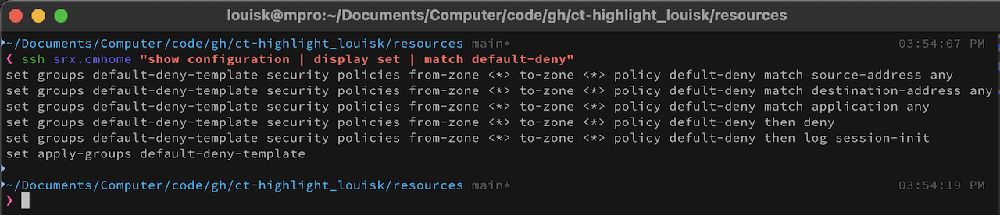
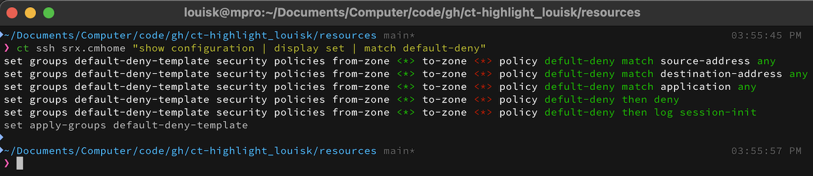
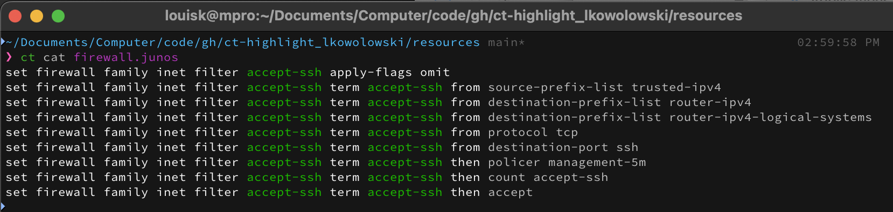
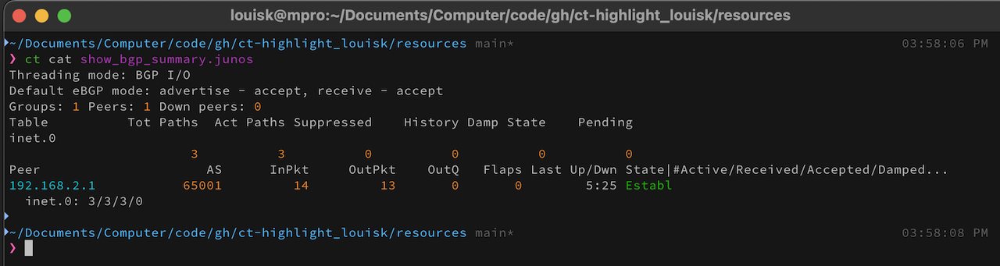
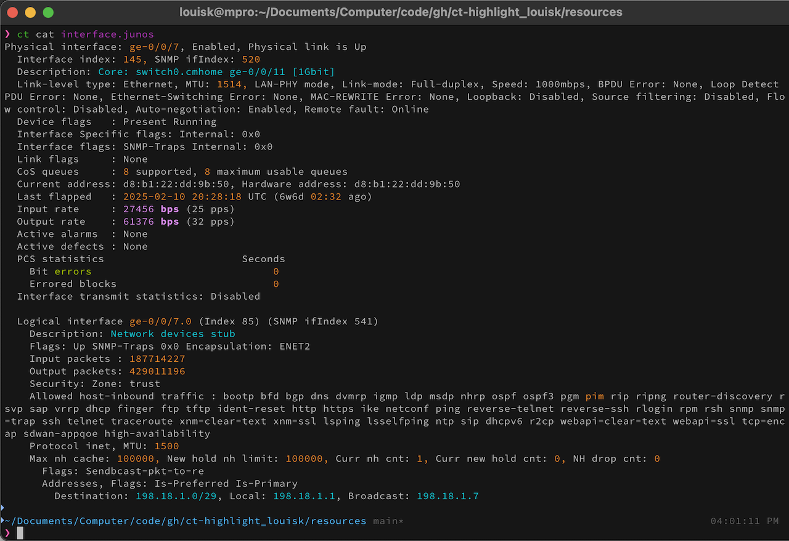
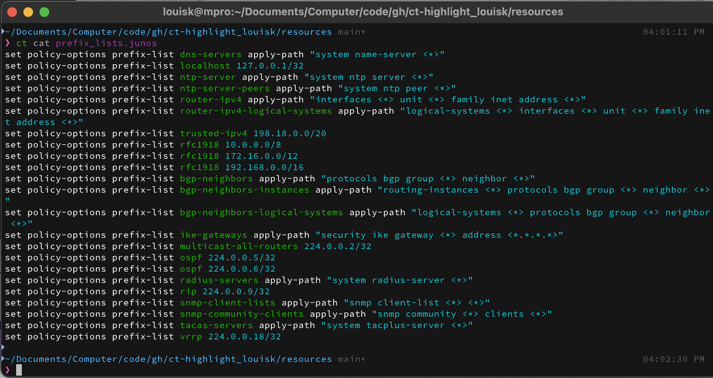

# ct-highlighting

**TLDR:** This repo will generate a chromaterm config (chromaterm.yml) that can be used for real-time syntax highlighting of network device config including Juniper and others.

## TOC

- [What's this about?](#What's this about?)
- [Use-Cases](#Use-cases)
- [Benefits](#Benefits)
- [Pre-requisites](#Pre-requisites)
- [Usage](#Usage)
- [Limitations](#Limitations)
- [Thanks](#Special thanks)

## What's this about?

Reading through network device output can be challenging. There is a lot of text, which can make it difficult to scan through and quickly find what you're looking for.



**It can be a lot easier when relevant parts are highlighted, allowing you to search faster**



This repo is the syntax highlighting I use on a frequent, if not daily basis when I have to work on/with network devices.

**Note:** The colors work with both a dark (black) terminal background, or blue(ish), as you can see in the images above.

## Examples

- **Reading Junos Security Policy Rules (Junos)**
  
  

- **Reading show bgp summary (Junos)**
  

- **Reading show interfaces (Junos)**
  

- **Reading Prefix lists (Junos)**
  

## Benefits

- Quicker troubleshooting allows you to more easily identify mis-configurations or issues like interfaces in up/down.
- Color codes can be customized to your liking. [HTML color codes](https://htmlcolorcodes.com/)
- You can define your own regexes to work with what ever platform you want.

## Pre-requisites

- Python 3.7+ Recommended (currently using 3.13)
- [Chromaterm](https://github.com/hSaria/ChromaTerm) - Shout out to **[hSaria](https://github.com/hSaria)** for buliding this fantastic tool that works with interactive applications such as ssh.
- On a Mac with [homebrew](https://brew.sh) install [uv](https://docs.astral.sh/uv/) with `brew install uv`
- Install chromaterm with `uv tool install chromaterm`
  - By default, uv will install things in ${HOME}/.local/bin
  - Add it to your path
    - For bash: `echo 'PATH=$PATH:${HOME}/.local/bin/' >> ${HOME}/.bash_profile`
    - For zsh: `echo 'path=(path ${HOME}/.local/bin/)' >> ${HOME}/.zshrc`
  - You can also install with `pip install chromaterm`

## Usage

- Clone this repo: `git clone git@github.com:louisk/ct-highlight.git
- Run `make install`. This will create files in ${HOME}/.config/chromaterm/
- Last, connect to a `Juniper` via ssh and issue a `show interfaces`
  - `ct ssh user@device`

## Customizing

- I've created files split up by the type of system they are designed for. If you don't want to use all of them, or you want to create new ones.
  - Making a new profile can be done with `cat chromaterm-colors.yml > new_profile.yml`
    and then adding your own regex.
- To recreate the chromaterm.yml file and install it, run `make build install`. This will generate a new chromaterm.yml file and install it in ${HOME}.config/chromaterm.
  - If you have any running chromaterm processes, you can run `make restart` (or append it to the above for `make build install restart` or `make all` for short)
- To test, open a new window in you terminal, use one of the following examples provided in the resources/ folder and pipe it to chromaterm (ct). For example: `cat resources/interface.junos | ct`

If you don't want to prepend your command with `ct` every time, you can write a function like this:

```bash
_ssh () {
	local OPTIND
	local JUNIPER
	local CISCO
	local PAN
	local UNIX
	local base_dir="${HOME}/.config/chromaterm"
	while getopts ":jcup" COMMAND_LINE_ARGUMENT
	do
		case "${COMMAND_LINE_ARGUMENT}" in
			(u) UNIX="YES"  ;;
			(c) CISCO="YES"  ;;
			(p) PAN="YES"  ;;
			(j) JUNIPER="YES"  ;;
			(\?) echo "-u provides UNIX (and Linux) syntax highlighting"
				echo "-j provides Juniper syntax highlighting"
				echo "-c provides Cisco (and alike) syntax highlighting"
				echo "-p provides PAN syntax highlighting"
				return 1 ;;
		esac
	done
	shift "$((OPTIND-1))"
	if [ "${JUNIPER}" = "YES" ]
	then
		platform="juniper"
	elif [ "${CISCO}" = "YES" ]
	then
		platform="cisco"
	elif [ "${PAN}" = "YES" ]
	then
		platform="pan"
	elif [ "${UNIX}" = "YES" ]
	then
		platform="unix"
	else
		platform="generic"
	fi
	conf_file="${base_dir}/${platform}.yml"
	if which ct > /dev/null
	then
		if [ -e "${conf_file}" ]
		then
			ct -c "${conf_file}" /usr/bin/ssh -ACxt "$@"
		else
			echo "${conf_file} doesn't exist"
		fi
	else
		if [ -e "${base_dir}/generic.yml" ]
		then
			ct -c "${base_dir}/generic.yml" /usr/bin/ssh -ACxt "$@"
		else
			echo "${base_dir}/generic.yml doesn't exist"
			sleep 2
			/usr/bin/ssh -ACxt "$@"
		fi
	fi
}
```

## Testing

- To test, open a new window in you terminal, use one of the following examples provided in the resources/ folder and pipe it to chromaterm (ct). For example: `cat resources/interface.junos | ct`
- I've included a `resources` dir with relevant snippets of config. You can run `ct cat resources/file` to see what it would look like

## Limitations

- There are lots of (versions of) network operating systems. It's likely that not all of them will work with the current set of config files, but you can easily modify it by adding or changing the filters to make the content you want colored the way you want.
- [This config file](chromaterm-juniper.yml) has been tested with SRX, EX, QFX, and MX platforms.
- [This config file](chromaterm-unix.yml) has been tested with MacOS, FreeBSD and Linux platforms.
- For more information on the `chromaterm` config file options go [HERE](https://github.com/hSaria/ChromaTerm#highlight-rules)
- For help with regex, I used [regex101](https://regex101.com)

## Special Thanks

Thanks to [hSaria](https://github.com/hSaria) for creating [Chromaterm](https://github.com/hSaria/ChromaTerm)
